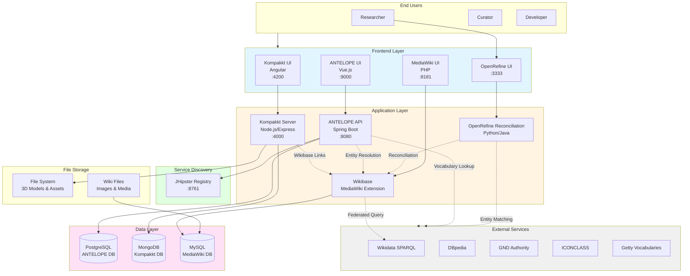
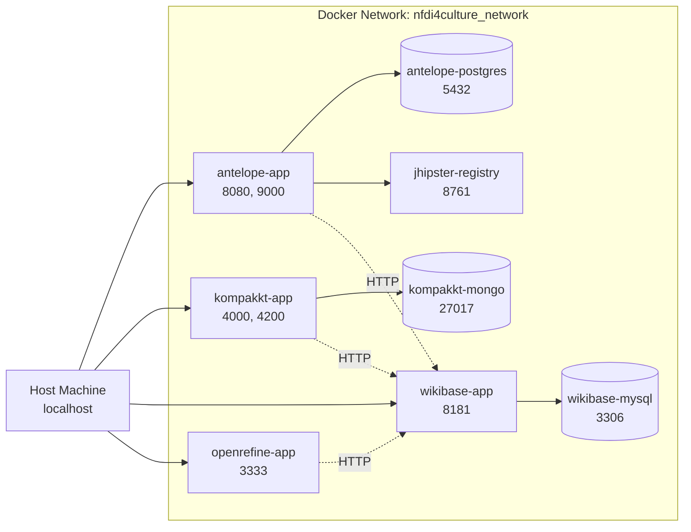
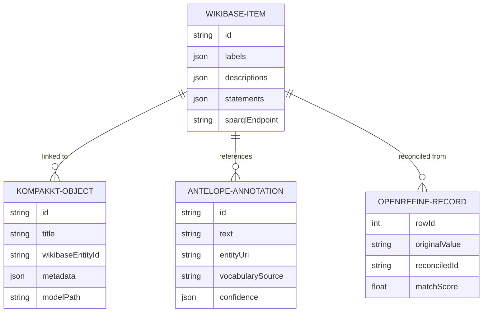

# NFDI4Culture Stack Architecture

## System Overview



## Component Details

### 1. MediaWiki + Wikibase

**Purpose:** Central knowledge graph and semantic data repository

**Technology Stack:**
- PHP 8.x with MediaWiki 1.45
- Wikibase extension for linked data
- MySQL 8.0 for storage
- SPARQL endpoint for queries

**Key Features:**
- RDF data model (Items, Properties, Statements)
- Federated SPARQL queries to Wikidata
- REST API for entity management
- Multilingual support

**Ports:**
- Web UI: 8181
- MySQL: 3306
- SPARQL: 8181/query/sparql

**Data Flow:**
```
External Data → OpenRefine → Reconciliation → Wikibase Items
Kompakkt Objects → Metadata Links → Wikibase Entities
ANTELOPE Annotations → Entity URIs → Wikibase Items
```

### 2. OpenRefine

**Purpose:** Data cleaning, transformation, and reconciliation

**Technology Stack:**
- Java 11+ application
- Embedded Jetty server
- Python extensions for custom reconciliation

**Key Features:**
- CSV/Excel data import
- Regex-based cleaning
- Reconciliation API to Wikibase
- Batch entity creation

**Ports:**
- Web UI: 3333

**Integration Points:**
- Reconciliation endpoint: `/reconcile` → Wikibase query API
- Export format: Wikibase schema with Quick Statements
- External reconciliation: Wikidata, GND, Getty

### 3. ANTELOPE (Annotation Service)

**Purpose:** Terminology service and entity linking for semantic annotation

**Technology Stack:**
- Spring Boot 2.7 backend
- Vue.js 3 + Vite frontend
- PostgreSQL database
- JHipster microservices architecture

**Key Features:**
- Named Entity Recognition (NER)
- Entity linking to multiple vocabularies
- Terminology search with tree hierarchies
- REST API for annotations

**Ports:**
- Backend API: 8080
- Frontend UI: 9000
- JHipster Registry: 8761
- PostgreSQL: 5432

**External Integrations:**
- Wikidata: Full-text search and SPARQL queries
- DBpedia: Entity lookup
- GND (German National Library)
- ICONCLASS (Art classification)
- Getty (AAT, TGN, ULAN)

**Data Flow:**
```
User Search → ANTELOPE API → Vocabulary Lookup → Results with Hierarchy
Annotation Request → Entity Resolution → Wikibase URI + External URIs
```

### 4. Kompakkt

**Purpose:** 3D object visualization and semantic annotation platform

**Technology Stack:**
- Angular 16+ frontend
- Node.js/Express backend
- MongoDB for metadata
- File system for 3D models (GLB, OBJ, FBX)

**Key Features:**
- 3D model viewer (Three.js)
- Annotation hotspots on 3D objects
- Wikibase entity linking
- Collaborative annotation

**Ports:**
- Frontend: 4200
- Backend API: 4000
- MongoDB: 27017

**Integration:**
```
3D Upload → Metadata Form → Wikibase Entity Selector → Linked Data
Annotations → ANTELOPE Vocabulary → Wikibase URIs → Knowledge Graph
```

## Docker Networking



**Network Configuration:**
- Network name: `nfdi4culture_network`
- Driver: bridge
- All containers on same network for inter-service communication
- Host port mapping for external access

## Data Model Relationships



## API Integration Patterns

### 1. Wikibase Entity Lookup

```http
GET http://localhost:8181/w/api.php?action=wbsearchentities&search={query}&language=en
```

**Used by:**
- Kompakkt: Entity selector dropdown
- OpenRefine: Reconciliation matching
- ANTELOPE: Local entity resolution

### 2. SPARQL Queries

```sparql
# Federated query example
PREFIX wd: <http://www.wikidata.org/entity/>
PREFIX wdt: <http://www.wikidata.org/prop/direct/>

SELECT ?item ?itemLabel ?image WHERE {
  ?item wdt:P31 wd:Q3305213 .  # Instance of painting
  OPTIONAL { ?item wdt:P18 ?image }
  SERVICE wikibase:label { bd:serviceParam wikibase:language "en" }
}
```

**Used by:**
- MediaWiki: Wikibase query service
- External tools: Data exploration
- Reports: Generating statistics

### 3. ANTELOPE Terminology API

```http
POST http://localhost:8080/api/terminology/search
Content-Type: application/json

{
  "query": "Vincent van Gogh",
  "vocabularies": ["wikidata", "dbpedia", "gnd"],
  "limit": 20
}
```

**Response includes:**
- Hierarchical relationships
- Multiple vocabulary sources
- Confidence scores

### 4. Kompakkt Annotation API

```http
POST http://localhost:4000/api/annotations
Content-Type: application/json

{
  "objectId": "507f1f77bcf86cd799439011",
  "position": {"x": 0.5, "y": 0.3, "z": 0.1},
  "entityUri": "http://localhost:8181/entity/Q42",
  "vocabularySource": "wikibase"
}
```

## Deployment Strategies

### Development Environment

```yaml
# docker-compose.dev.yml
services:
  - Single-container setups
  - Local volume mounts for hot reload
  - Debug ports exposed
  - H2/SQLite in-memory databases
```

### Production Environment

```yaml
# docker-compose.prod.yml
services:
  - Multi-container with health checks
  - Persistent volumes for data
  - Nginx reverse proxy
  - SSL/TLS certificates
  - Backup automation
  - Log aggregation
```

## Security Considerations

1. **Authentication:**
   - MediaWiki: OAuth 2.0 for external apps
   - ANTELOPE: JWT tokens via JHipster
   - Kompakkt: Session-based auth

2. **Network Isolation:**
   - Databases not exposed to host
   - Internal Docker network for inter-service communication
   - API gateway pattern for production

3. **Data Protection:**
   - PostgreSQL authentication
   - MongoDB authentication enabled
   - File permissions for 3D models

## Monitoring & Health Checks

```yaml
healthcheck:
  test: ["CMD", "curl", "-f", "http://localhost:8080/management/health"]
  interval: 30s
  timeout: 10s
  retries: 3
  start_period: 60s
```

**Metrics Collected:**
- API response times
- Database connection pool status
- Container resource usage (CPU, memory)
- Error rates and logs

## Backup Strategy

1. **Databases:**
   - Daily automated dumps
   - 30-day retention
   - Stored in `./backups/` volume

2. **File Storage:**
   - Weekly full backups
   - Rsync to external storage

3. **Configuration:**
   - Version controlled in Git
   - Environment variables in `.env` (not committed)

## Scaling Considerations

**Current Setup:** Single-host Docker Compose (suitable for demo and development)

**Production Scaling Options:**
1. **Docker Swarm:** Multi-node orchestration
2. **Kubernetes:** Enterprise-grade with Helm charts
3. **Load Balancing:** HAProxy or Nginx for multiple frontend replicas
4. **Database Clustering:** PostgreSQL replication, MongoDB replica sets

---

**Last Updated:** November 2025  
**Version:** 1.0.0
