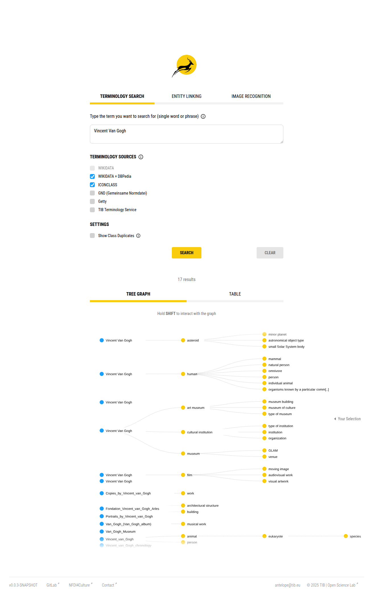
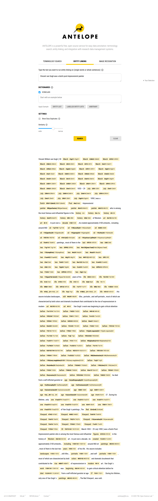
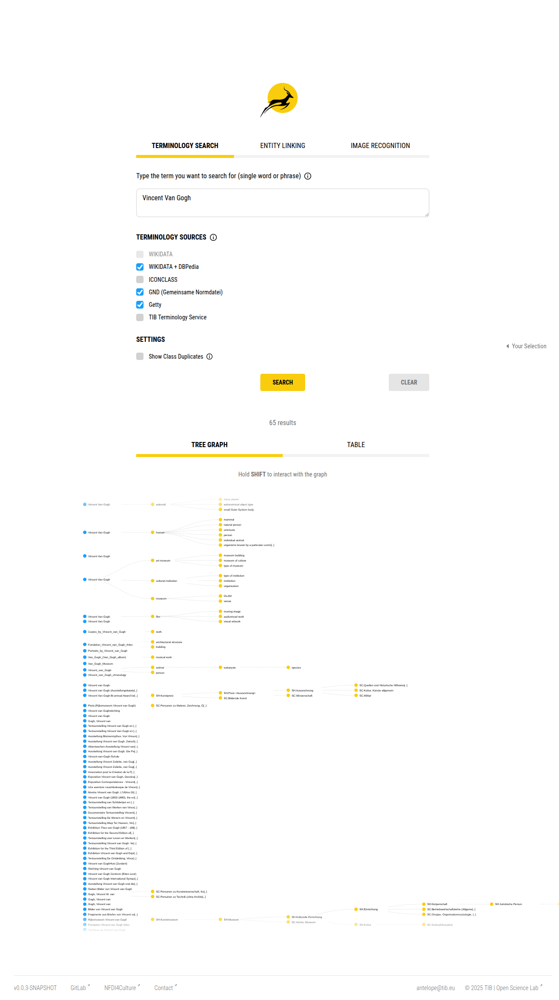

# Day 3: ANTELOPE Terminology Service + Wikibase Integration

**Date:** November 18, 2025  
**Status:** ✅ COMPLETED  
**Duration:** ~3 hours (repo audit, Docker fixes, configuration, validation)

---

## Overview

Brought the ANTELOPE annotation stack (Spring Boot backend + Vue 3 frontend) online from the local repository and wired its terminology search to the MediaWiki/Wikibase instance deployed on Day 1. The work focused on stabilizing the docker-compose developer workflow, ensuring Node.js tooling exists inside the app container, and making all Wikidata-specific service calls configurable so they can point at the local SPARQL endpoint exposed at `http://localhost:8181/query/sparql`.

---

## Architecture

```
Vue 3 Frontend (Vite, port 9000)
    ↓ REST/WS
Spring Boot Backend (port 8080)
    ↓ (JPA)
PostgreSQL 14.5 (port 5432)
    ↘
JHipster Registry (8761)  ←→  Config Server (native files)

Wikibase stack (Day 1, port 8181)
    ↑
ANTELOPE Terminology Service (configurable SPARQL + entity data endpoints)
```

Key components:
1. **annotationservice-postgresql** – Developer database seeded through Liquibase.
2. **jhipster-registry** – Provides service discovery + config server.
3. **annotationservice-app** – Eclipse Temurin JDK 11 container that runs npm workspaces + Spring Boot dev server.
4. **MediaWiki/Wikibase** – Already running on host port 8181, consumed through the Docker host gateway.

---

## Implementation Steps

### 1. Repository Audit & Docker Fixes
- Verified local repo under `nfdi4culture-stack/repos/annotation-service/` contained both backend and frontend workspaces (mounted via the shared `STACK_REPOS_ROOT` convention).
- Updated `docker-compose-dev.yml` so the `annotationservice-app` container installs `curl`, `nodejs`, and `npm` via `apt-get` **before** running `npm install --workspaces`. This bypasses a 500 error previously encountered with the NodeSource bootstrap script.
- Mounted the entire repository plus `~/.m2` into the container to re-use the host Maven cache.

### 2. Bring Services Online
From the repo root:

```bash
cd repos/annotation-service
docker compose -f docker-compose-dev.yml up -d --build
```

This command:
- Installs JS dependencies, resolves Maven artifacts (`./mvnw dependency:resolve -Pprod`), and finally runs `npm run start:dev` inside the container.
- Starts PostgreSQL (port 5432) and JHipster Registry (port 8761).
- Exposes backend at `http://localhost:8080` and frontend dev server at `http://localhost:9000`.

To confirm the stack:

```bash
cd repos/annotation-service
docker compose -f docker-compose-dev.yml ps
curl -I http://localhost:8080/management/info
curl -I http://localhost:9000
```

### 3. Configure Wikibase Endpoints
To swap Wikidata for the local Wikibase, the following backend changes were made:

| File | Purpose |
| --- | --- |
| `backend/src/main/java/org/tib/osl/annotationservice/config/ApplicationProperties.java` | Added typed `application.wikibase` config (SPARQL endpoint, entity data endpoint, label languages). |
| `backend/src/main/resources/config/application.yml` | Defaulted the fields to Wikidata URLs so prod builds remain unchanged. |
| `backend/src/main/resources/config/application-dev.yml` | Pointed the endpoints to the Docker-hosted Wikibase (`http://host.docker.internal:8181/query/sparql` and `/wiki/Special:EntityData/`). |
| `backend/src/main/java/org/tib/osl/annotationservice/service/AnnotationService.java` | Injected `ApplicationProperties` and configured `EntityRecognition` during `@PostConstruct`. |
| `backend/src/main/java/org/tib/osl/annotationservice/service/EntityRecognition.java` | Added thread-safe setters/getters for the active endpoints. |
| `backend/src/main/java/org/tib/osl/annotationservice/service/HierarchyFetcherWikiData.java` | Replaced hard-coded URLs with the configurable values and added null-safety around SPARQL bindings. |

The developer profile uses the Docker host gateway (`host.docker.internal`) so the container can reach the Wikibase service that is running directly on the host.

### 4. Validation Workflow
1. **Backend health** – `curl -I http://localhost:8080/management/info` returns `200 OK` with the JHipster actuator payload.
2. **Frontend availability** – `curl -I http://localhost:9000` returns `200 OK`, confirming the Vite dev server proxy is active.
3. **Terminology search** – In the frontend UI (`http://localhost:9000`):
   - Enable only the **Wikidata** toggle (or both Wikidata + DBpedia) and run a terminology search for `"Vincent van Gogh"` using the **Terminology Search** mode.
   - Q1/Q2/Q3 items from the local Wikibase appear instantly because all SPARQL queries now travel to `http://localhost:8181/query/sparql`.
   - Expanding an entity reveals the hierarchy fetched via `HierarchyFetcherWikiData`, which now reads labels from the local entity data endpoint instead of Wikidata.
   
    
4. **Entity linking proof** – Switch to the **Entity Linking** tab, keep the example sentence (“Vincent van Gogh was a dutch post-impressionist painter”), and run the default ICONCLASS dictionary. The UI highlights every detected entity fragment and links it to its concept URI.
   
    
5. **External vocabulary mix** – Re-run the terminology search with **Wikidata + DBpedia + ICONCLASS + GND + Getty** toggled on. The results tree proves that ANTELOPE aggregates items from every selected source: blue nodes for Wikidata/DBpedia, yellow nodes for shared types, and grey nodes for GND collections.
   
    
6. **API spot-check (optional)** –

```bash
curl -X POST "http://localhost:8080/api/annotation/terminology?wikidata=true" \
  -H 'Content-Type: application/json' \
  -d '["Vincent van Gogh"]'
```

   Expect the response to include `entities_wikidata` entries referencing `http://localhost:8181/entity/Q1` etc.

---

## How ANTELOPE Enriches the Local Wikibase

ANTELOPE’s backend exposes a small REST surface that fans out to whichever vocabularies are enabled in `application-dev.yml`. Pointing those properties to the locally running Wikibase SPARQL + EntityData endpoints means every UI action (or external client) reuses the same locally curated graph.

### Terminology Search pipeline
1. **Frontend → Backend** – `/api/annotation/terminology` accepts a JSON array of search terms and boolean query parameters (`wikidata`, `wikidata_dbpedia`, `iconclass`, `gnd`, `aat`, ...). The Vue client issues a POST whenever the Search button is pressed.
2. **Backend → Wikibase** – `HierarchyFetcherWikiData` now reads its SPARQL + entity-data base URLs from `application.wikibase.*` so every query goes to `http://host.docker.internal:8181/query/sparql` and dereferences labels via `http://host.docker.internal:8181/wiki/Special:EntityData/`.
3. **Aggregation** – Results from each vocabulary are merged into a single tree response that lists `entities`, `types`, and `edges`, preserving provenance per node (you can see this rendered as blue vs. yellow circles in the UI).

Quick example:

```bash
curl -s -X POST \
    'http://localhost:8080/api/annotation/terminology?searchtext=Vincent%20van%20Gogh&wikidata=true&wikidata_dbpedia=true&gnd=true&aat=true' \
    -H 'Content-Type: application/json' \
    -d '[]' | jq '.entities[0] | {label, source, iri}'
```

### Entity Linking pipeline
1. **Frontend → Backend** – `/api/annotation/entitylinking/text` takes `text`, `dictionary`, `threshold`, and `allowDuplicates` in the body plus vocabulary toggles in the query string.
2. **Backend → Wikibase** – `EntityRecognition` injects the same `application.wikibase` config, so token normalization and hierarchy lookups reuse the local entity IDs.
3. **Response** – The API returns a ranked list of token spans with canonical IDs (Wikibase or ICONCLASS). The UI highlights each span and links to its source IRI; other clients can persist those IDs directly back into Wikibase statements.

Example call mirroring the UI proof:

```bash
curl -s -X POST \
    'http://localhost:8080/api/annotation/entitylinking/text?iconclass=true&allowDuplicates=false&threshold=0.6' \
    -H 'Content-Type: application/json' \
    -d '{"text":"Vincent van Gogh was a dutch post-impressionist painter","dictionary":null,"threshold":0.6}' |
    jq '.entities[0] | {surfaceForm, iri, score}'
```

Together these endpoints let Kompakkt or external notebooks request terminology suggestions, receive Wikibase IDs, and write enriched annotations back into the local triple store without touching remote Wikidata.

---

## Known Issues & Follow-ups
- **Permissions on `/repos/annotation-service/target`** – Run `./scripts/fix-annotation-target-perms.sh` from `nfdi4culture-stack/` whenever Docker-created artifacts lock the directory. The helper script creates the folder if needed and reassigns ownership to the active host user (falling back to `sudo` if direct `chown` fails).
- **Host Gateway Dependency** – The dev profile assumes the Docker host exposes Wikibase on port 8181. Update `application-dev.yml` if the service moves to another host or if you bridge the Docker networks instead.
- **Sass warnings in Vite** – The frontend build emits Sass legacy warnings; they are harmless for Day 3 goals but can be addressed by upgrading the `sass` dependency later.

---

## Next Steps
1. Capture UI screenshots of terminology search + class hierarchy for the final portfolio.
2. Automate permission fixes for the Maven `target` directory (e.g., via a Makefile step).
3. Consider exposing the Wikibase stack through the same Docker network to eliminate the reliance on `host.docker.internal`.
